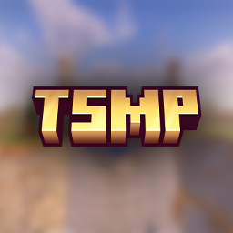

<h1 align="center">TRIX Studios Launcher</h1>

---

### **<ins>
Téléchargement :
**

Vous pouvez télécharger le launcher à partir des [Releases GitHub](../../../releases).

Plateformes supportées :

- Windows 
- Linux
- MacOS

Si vous téléchargez à partir des Releases, sélectionnez le programme d'installation de votre système.

 Plateforme | Fichier |
| -------- | ---- |
| Windows x64 | `TRIX-Studios-Launcher-win-x64.exe ` |
| macOS x64 | `TRIX-Studios-Launcher-mac-x64.dmg` |
| macOS arm64 | `TRIX-Studios-Launcher-mac-arm64.dmg` |
| Linux x64 | `TRIX-Studios-Launcher-linux-x86_64.AppImage` |

---

### Crédits :

Projet original [Selvania-Launcher de Luuxis](https://github.com/luuxis/Selvania-Launcher)
